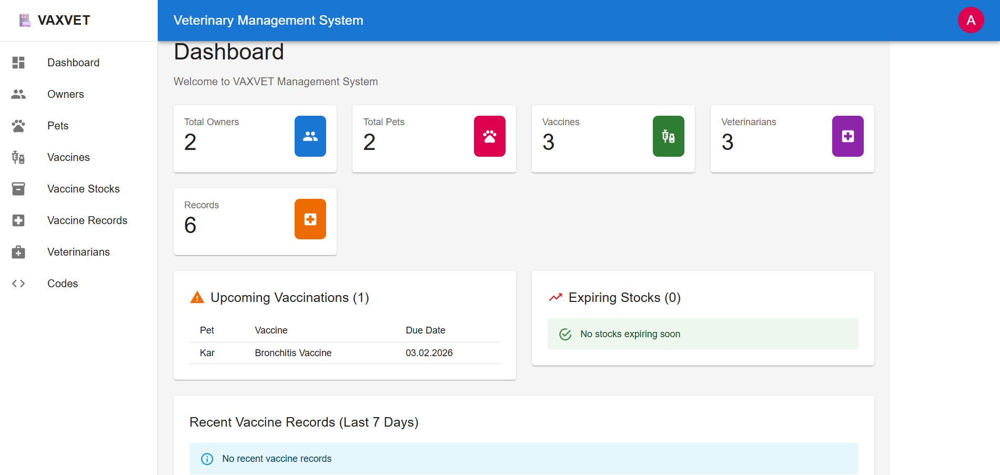
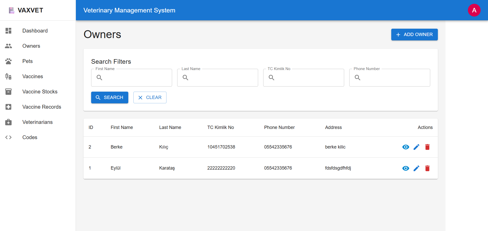
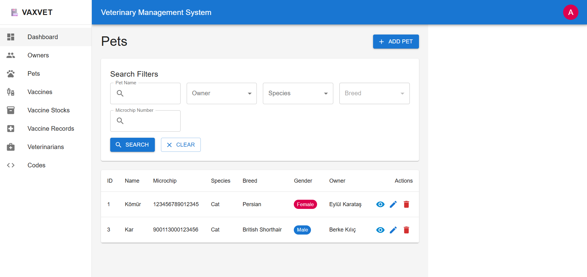
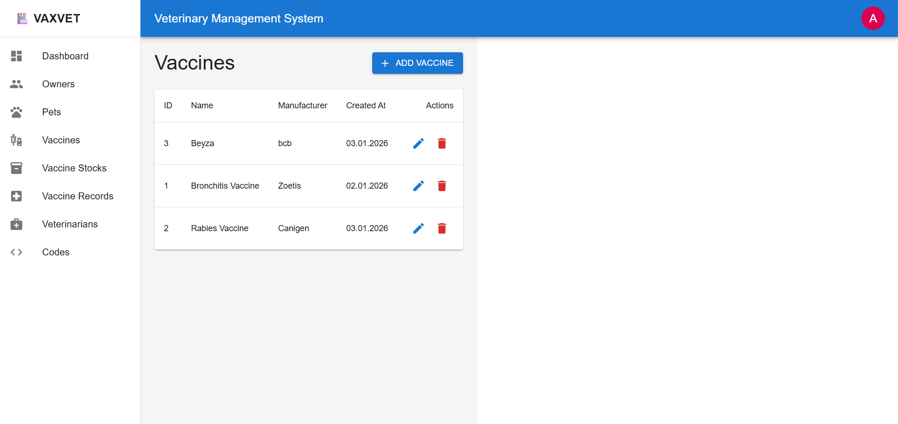
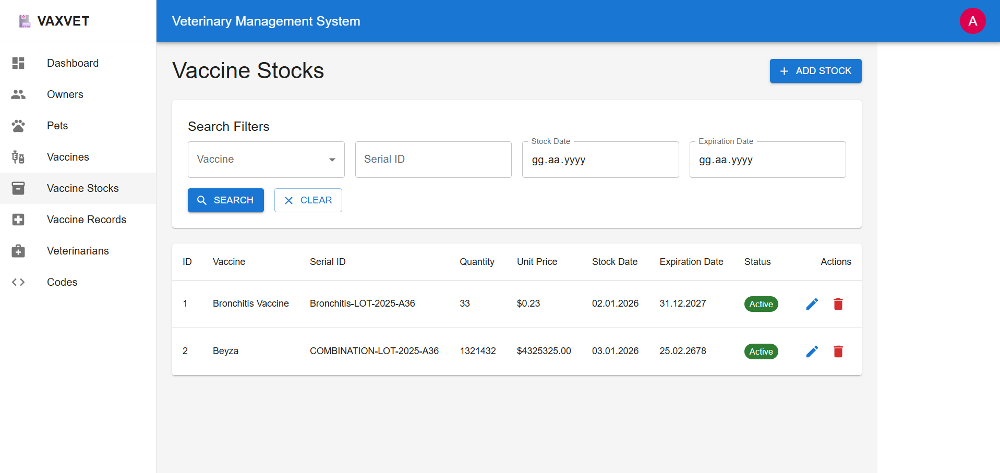
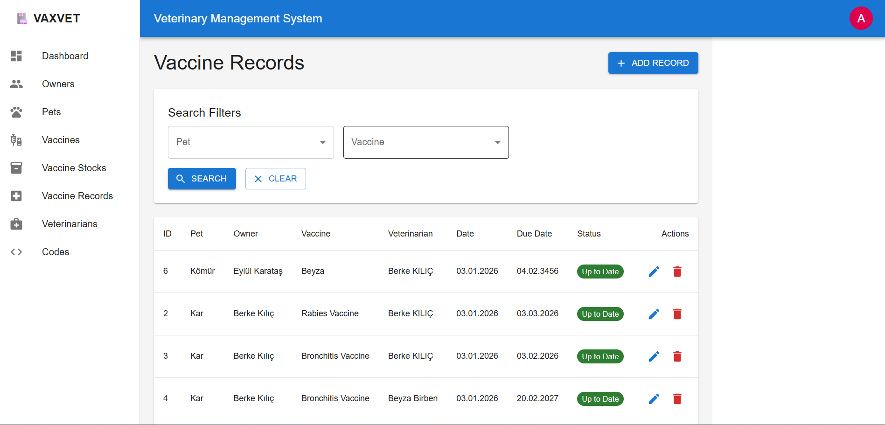
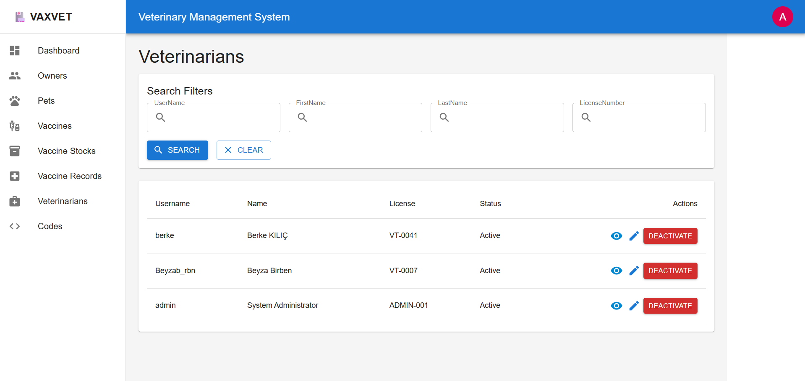

# 🐾 VAXVET Frontend - Veterinary Clinic Management System

A modern, responsive web application built with **React**, **TypeScript**, and **Vite**, designed to support veterinary clinic workflows through a clean and intuitive user interface. The application enables interaction with core domain concepts such as pets, vaccinations, appointments, and medical records.
This frontend primarily serves as a **consumer of the VAXVET Backend API**, providing a realistic usage scenario to **validate backend architecture, security mechanisms (JWT-based authentication), and business logic.** Its role is intentionally supportive, focusing on demonstrating correct API integration rather than acting as a standalone production system.

[](https://vaxvet-frontend.vercel.app)
[](https://reactjs.org/)
[](https://www.typescriptlang.org/)
[](https://vitejs.dev/)

## 📋 Table of Contents

- [Overview](#overview)
- [Features](#features)
- [Tech Stack](#tech-stack)
- [Prerequisites](#prerequisites)
- [Installation & Setup](#installation--setup)
- [Project Structure](#project-structure)
- [Available Scripts](#available-scripts)
- [Environment Variables](#environment-variables)
- [API Integration](#api-integration)
- [Deployment](#deployment)
- [Contributing](#contributing)
- [License](#license)

---

## 🎯 Overview

VAXVET Frontend is a single-page application (SPA) that connects to the [VAXVET Backend API](https://github.com/BeyzaBirben/VAXVET) to provide a complete veterinary clinic management solution. The application offers role-based interfaces for different user types with a clean, modern UI.

### Live Demo

**🔗 [https://vaxvet-frontend.vercel.app](https://vaxvet-frontend.vercel.app)**

### Key Highlights

- **Modern UI/UX**: Clean, intuitive interface built with React and TypeScript
- **Responsive Design**: Works seamlessly on desktop, tablet, and mobile devices
- **Type Safety**: Full TypeScript implementation for better developer experience
- **Fast Development**: Vite for lightning-fast HMR and build times
- **PProduction-oriented build and deployment configuration**: Deployed on Vercel with optimized builds
- **Modular Architecture**: Organized by features for easy maintenance


---

<details>
  <summary><b>📸 Screenshots (click to expand)</b></summary>

  <br/>

  | Page | Preview |
  |------|---------|
  | Login |  |
  | Register |  |
  | Dashboard |  |
  | Owners |  |
  | Pets |  |
  | Vaccines |  |
  | Vaccine Stocks |  |
  | Vaccine Records |  |
  | Veterinarians |  |

</details>

---

## ✨ Features

### Core Functionality

- **🔐 Authentication System**
  - Secure login and registration
  - JWT token-based authentication
  - Protected routes with authentication guards
  - Session handling with automatic logout on token expiration
  - Session management

- **🐕 Pet Management**
  - Add, edit, and view pet profiles
  - Complete pet information (species, breed, birth date, gender)
  - Link pets to owners
  - Search and filter pets
  - View pet details with vaccination history

- **👥 Owner Management**
  - Register new pet owners
  - Update owner information
  - View owner details with all associated pets
  - TCKN (Turkish National ID) validation
  - Contact information management
  - Search and filter owners

- **💉 Vaccination System**
  - Record new vaccinations
  - View vaccination history by pet
  - Track vaccination records
  - Link vaccinations to specific vaccine stocks
  - Associate veterinarian with each vaccination
  - Filter and search vaccination records

- **📦 Inventory Management**
  - View vaccine and medicine stock levels
  - Track stock by batch number
  - Monitor expiration dates
  - Manage stock quantities
  - Add new stock entries
  - Update stock information

- **🧬 Vaccine Master Data**
  - Manage vaccine types and definitions
  - Add new vaccines
  - Update vaccine information
  - View all available vaccines

- **👨‍⚕️ Veterinarian Management**
  - Veterinarian profile management
  - Add and edit veterinarian information
  - View veterinarian details
  - Track veterinarian specializations

- **📋 Code Management**
  - Manage lookup codes and reference data
  - Create new codes
  - Edit existing codes
  - Organize codes by type
  - Used for dropdowns and standardized values

### Technical Features

- **📱 Responsive Design**: Mobile-first approach with adaptive layouts
- **🎨 Modern UI Components**: Reusable component library
- **🔍 Search & Filter**: Advanced search across all entities
- **📄 CRUD Operations**: Complete create, read, update, delete for all entities
- **✅ Form Validation**: Client-side validation with error messages
- **🔄 Loading States**: User-friendly loading indicators
- **⚠️ Error Handling**: Graceful error handling with user feedback
- **🛣️ Client-Side Routing**: Fast navigation with React Router
- **💾 State Management**: Efficient state handling
- **⚡ Performance**: Code splitting and optimized builds

---

## 🛠️ Tech Stack

| Technology | Version | Purpose |
|-----------|---------|---------|
| **React** | 18+ | UI library for building components |
| **TypeScript** | 5+ | Type-safe JavaScript |
| **Vite** | 5+ | Build tool and dev server |
| **React Router** | 6+ | Client-side routing |
| **Axios** | 1+ | HTTP client for API calls |
| **ESLint** | 9+ | Code linting and quality |

---

## 📦 Prerequisites

Before running this project, ensure you have:

- [Node.js](https://nodejs.org/) 18.x or higher
- [npm](https://www.npmjs.com/) or [yarn](https://yarnpkg.com/)
- [VAXVET Backend API](https://github.com/BeyzaBirben/VAXVET) running (for local development)

---

## 🚀 Installation & Setup

### 1. Clone the Repository

```bash
git clone https://github.com/BeyzaBirben/vaxvet-frontend.git
cd vaxvet-frontend
```

### 2. Install Dependencies

```bash
npm install
# or
yarn install
```

### 3. Configure Environment Variables

Create a `.env.development` file for local development:

```env
VITE_API_BASE_URL=http://localhost:5000/api
```

Create a `.env.production` file for production:

```env
VITE_API_BASE_URL=https://your-backend-api.com/api
```

### 4. Start Development Server

```bash
npm run dev
# or
yarn dev
```

The application will be available at `http://localhost:5173`

### 5. Build for Production

```bash
npm run build
# or
yarn build
```

### 6. Preview Production Build

```bash
npm run preview
# or
yarn preview
```

---

## 📁 Project Structure

```
vaxvet-frontend/
│
├── 📁 public/                          # Static assets
│   └── vite.svg                        # Vite logo
│
├── 📁 src/                             # Source code
│   │
│   ├── 📁 api/                         # API service layer
│   │   ├── axios.ts                    # Axios instance configuration
│   │   ├── auth.ts                     # Authentication API calls
│   │   ├── codes.ts                    # Code management API
│   │   ├── owners.ts                   # Owner management API
│   │   ├── pets.ts                     # Pet management API
│   │   ├── vaccineRecords.ts           # Vaccination records API
│   │   ├── vaccineStocks.ts            # Vaccine stock API
│   │   ├── vaccines.ts                 # Vaccine master data API
│   │   └── veterinarians.ts            # Veterinarian management API
│   │
│   ├── 📁 assets/                      # Application assets
│   │   └── react.svg                   # React logo
│   │
│   ├── 📁 components/                  # Reusable components
│   │   └── layout/
│   │         └── Layout.tsx           # Layout 
│   │   └── ProtectedRoute.tsx         # Authentication guard component
│   │
│   ├── 📁 pages/                       # Page components (routes)
│   │   │
│   │   ├── 📁 codes/                   # Code management pages
│   │   │   ├── CodesCreate.tsx         # Create new code
│   │   │   ├── CodesEdit.tsx           # Edit existing code
│   │   │   └── CodesList.tsx           # List all codes
│   │   │
│   │   ├── 📁 owners/                  # Owner management pages
│   │   │   ├── OwnerCreate.tsx         # Create new owner
│   │   │   ├── OwnerDetail.tsx         # View owner details
│   │   │   ├── OwnerEdit.tsx           # Edit owner information
│   │   │   └── OwnerList.tsx           # List all owners
│   │   │
│   │   ├── 📁 pets/                    # Pet management pages
│   │   │   ├── PetCreate.tsx           # Create new pet
│   │   │   ├── PetDetail.tsx           # View pet details
│   │   │   ├── PetEdit.tsx             # Edit pet information
│   │   │   └── PetList.tsx             # List all pets
│   │   │
│   │   ├── 📁 vaccineRecords/          # Vaccination record pages
│   │   │   ├── VaccineRecordCreate.tsx # Record new vaccination
│   │   │   ├── VaccineRecordEdit.tsx   # Edit vaccination record
│   │   │   └── VaccineRecordList.tsx   # List all vaccinations
│   │   │
│   │   ├── 📁 vaccineStocks/           # Stock management pages
│   │   │   ├── VaccineStockCreate.tsx  # Add new stock
│   │   │   ├── VaccineStockEdit.tsx    # Edit stock information
│   │   │   └── VaccineStockList.tsx    # List all stock items
│   │   │
│   │   ├── 📁 vaccines/                # Vaccine master data pages
│   │   │   ├── VaccineCreate.tsx       # Create new vaccine type
│   │   │   ├── VaccineEdit.tsx         # Edit vaccine information
│   │   │   └── VaccineList.tsx         # List all vaccines
│   │   │
│   │   ├── 📁 veterinarians/           # Veterinarian pages
│   │   │   ├── VeterinarianDetail.tsx  # View veterinarian details
│   │   │   ├── VeterinarianEdit.tsx    # Edit veterinarian info
│   │   │   └── VeterinarianList.tsx    # List all veterinarians
│   │   │
│   │   │   # Authentication pages
│   │   ├── Login.tsx               # Login page
│   │   │── Dashboard.tsx           # Dashboard
│   │   └── Register.tsx             # Registration page
│   │   ├── 📁 store/
│   │   └── authStore.ts             # AuthStore
│   │   ├── 📁 types/
│   │   │    │── api.ts               # Api
│   │   │    │── auth.ts              # Auth
│   │   │    ├── codes.ts             # Codes
│   │   │    ├── owner.ts             # Owner
│   │   │    │── pet.ts               # Pet
│   │   │    └── vaccine.ts           # Vaccine
│   │   ├── 📁 utils/
│   │   └── constants.ts              # Constants

│   ├── App.tsx                         # Root component
│   ├── main.tsx                        # Application entry point
│   ├── index.css                       # index css
│   └── App.css                         # App css
│
├── .env.development                    # Development environment variables
├── .env.production                     # Production environment variables
├── .gitignore                          # Git ignore rules
├── Dockerfile                          # Docker configuration
├── eslint.config.js                    # ESLint configuration
├── index.html                          # HTML template
├── package.json                        # Dependencies and scripts
├── package-lock.json                   # Locked dependencies
├── tsconfig.json                       # TypeScript configuration
├── tsconfig.app.json                   # App-specific TS config
├── tsconfig.node.json                  # Node-specific TS config
├── vercel.json                         # Vercel deployment config
├── vite.config.ts                      # Vite configuration
└── README.md                           # Project documentation
```

---

## 📜 Available Scripts

### Development

```bash
# Start development server with HMR
npm run dev

# Start dev server and open in browser
npm run dev -- --open
```

### Build

```bash
# Build for production
npm run build

# Preview production build locally
npm run preview
```

### Code Quality

```bash
# Run ESLint
npm run lint

# Fix ESLint errors automatically
npm run lint -- --fix
```

### Type Checking

```bash
# Run TypeScript compiler check
npx tsc --noEmit
```

---

## ⚙️ Environment Variables

### Required Variables

| Variable | Description | Example |
|----------|-------------|---------|
| `VITE_API_BASE_URL` | Backend API base URL | `http://localhost:5000/api` |

**Note**: All environment variables must be prefixed with `VITE_` to be exposed to the client-side code.

---

## 🔌 API Integration

### API Client Configuration

The application uses Axios for HTTP requests with a centralized configuration:

```typescript
// src/api/axios.ts
import axios from 'axios';

const api = axios.create({
  baseURL: import.meta.env.VITE_API_BASE_URL,
  headers: {
    'Content-Type': 'application/json',
  },
});

// Request interceptor to add JWT token
api.interceptors.request.use(
  (config) => {
    const token = localStorage.getItem('token');
    if (token) {
      config.headers.Authorization = `Bearer ${token}`;
    }
    return config;
  },
  (error) => Promise.reject(error)
);

// Response interceptor for error handling
api.interceptors.response.use(
  (response) => response.data,
  (error) => {
    if (error.response?.status === 401) {
      // Redirect to login on unauthorized
      localStorage.removeItem('token');
      window.location.href = '/login';
    }
    return Promise.reject(error);
  }
);

export default api;
```

### API Service Modules

The API layer is organized by domain entities:

#### 1. Authentication API (`src/api/auth.ts`)

```typescript
export const authApi = {
  login: async (credentials: LoginRequest): Promise<LoginResponse> => {
    const response = await axiosInstance.post<LoginResponse>(
      API_ENDPOINTS.LOGIN,
      credentials
    );
    return response.data;
  },

  logout: () => {
    localStorage.removeItem('token');
    localStorage.removeItem('user');
  },

  getToken: (): string | null => {
    return localStorage.getItem('token');
  },

  isAuthenticated: (): boolean => {
    return !!localStorage.getItem('token');
  },
};
```

#### 2. Pet API (`src/api/pets.ts`)

```typescript
import type { Pet, PetCreateDto, PetUpdateDto, PetSearchDto } from '../types/pet';

// Backend'den dönen paket yapısı
interface ApiResponse<T> {
  success: boolean;
  data: T;
  message?: string;
}

export const petsApi = {
  // Get All The Pets
  getAll: async (): Promise<Pet[]> => {
    const response = await axiosInstance.get<Pet[]>(API_ENDPOINTS.PETS);
    return response.data;
  },

  // Get by ID
  getById: async (id: number): Promise<Pet> => {
    const response = await axiosInstance.get<Pet>(`${API_ENDPOINTS.PETS}/${id}`);
    return response.data;
  },

  // Get by Owner
  getByOwnerId: async (ownerId: number): Promise<Pet[]> => {
    const response = await axiosInstance.get<Pet[]>(
      API_ENDPOINTS.PETS_BY_OWNER(ownerId)
    );
    return response.data;
  },

  // Add
  create: async (data: PetCreateDto): Promise<Pet> => {
    const response = await axiosInstance.post<ApiResponse<Pet>>(
      API_ENDPOINTS.PETS,
      data
    );
    return response.data.data;
  },

  // Update
  update: async (id: number, data: PetUpdateDto): Promise<Pet> => {
    const response = await axiosInstance.put<ApiResponse<Pet>>(
      `${API_ENDPOINTS.PETS}/${id}`,
      data
    );
    return response.data.data;
  },

  // Delete
  delete: async (id: number): Promise<void> => {
    await axiosInstance.delete(`${API_ENDPOINTS.PETS}/${id}`);
  },

  // Search
  search: async (criteria: PetSearchDto): Promise<Pet[]> => {
    const response = await axiosInstance.post<Pet[]>(
      API_ENDPOINTS.PETS_SEARCH,
      criteria
    );
    return response.data;
  },
```

#### 3. Owner API (`src/api/owners.ts`)

```typescript
export const ownersApi = {
  // Get all owners
  getAll: async (): Promise<Owner[]> => {
    const response = await axiosInstance.get<Owner[]>(API_ENDPOINTS.OWNERS);
    return response.data;
  },

  // Get owner by ID
  getById: async (id: number): Promise<Owner> => {
    const response = await axiosInstance.get<Owner>(`${API_ENDPOINTS.OWNERS}/${id}`);
    return response.data;
  },

  // Create owner
  create: async (data: OwnerCreateDto): Promise<Owner> => {
    const response = await axiosInstance.post<{ success: boolean; data: Owner }>(
      API_ENDPOINTS.OWNERS,
      data
    );
    return response.data.data;
  },

  // Update owner
  update: async (id: number, data: OwnerUpdateDto): Promise<Owner> => {
    const response = await axiosInstance.put<{ success: boolean; data: Owner }>(
      `${API_ENDPOINTS.OWNERS}/${id}`,
      data
    );
    return response.data.data;
  },

  // Delete owner
  delete: async (id: number): Promise<void> => {
    await axiosInstance.delete(`${API_ENDPOINTS.OWNERS}/${id}`);
  },

  // Search owners
  search: async (criteria: OwnerSearchDto): Promise<Owner[]> => {
    const response = await axiosInstance.post<Owner[]>(
      API_ENDPOINTS.OWNERS_SEARCH,
      criteria
    );
    return response.data;
  },
};
```

#### 4. Vaccination Records API (`src/api/vaccineRecords.ts`)

```typescript
export const vaccineRecordsApi = {
  getAll: async (): Promise<VaccineRecord[]> => {
    const response = await axiosInstance.get<VaccineRecord[]>(
      API_ENDPOINTS.VACCINE_RECORDS
    );
    return response.data;
  },

  getById: async (id: number): Promise<VaccineRecord> => {
    const response = await axiosInstance.get<VaccineRecord>(
      `${API_ENDPOINTS.VACCINE_RECORDS}/${id}`
    );
    return response.data;
  },

  create: async (data: VaccineRecordCreateDto): Promise<VaccineRecord> => {
    const response = await axiosInstance.post(
      API_ENDPOINTS.VACCINE_RECORDS,
      data
    );
    
    if (response.data && response.data.data) {
      return response.data.data;
    }
    return response.data;
  },

  update: async (id: number, data: VaccineRecordUpdateDto): Promise<VaccineRecord> => {
    const response = await axiosInstance.put(
      `${API_ENDPOINTS.VACCINE_RECORDS}/${id}`,
      data
    );
    
    if (response.data && response.data.data) {
      return response.data.data;
    }
    return response.data;
  },

  delete: async (id: number): Promise<void> => {
    await axiosInstance.delete(`${API_ENDPOINTS.VACCINE_RECORDS}/${id}`);
  },

  search: async (criteria: VaccineRecordSearchDto): Promise<VaccineRecord[]> => {
    const response = await axiosInstance.post<VaccineRecord[]>(
      API_ENDPOINTS.VACCINE_RECORDS_SEARCH,
      criteria
    );
    return response.data;
  },
};
```

#### 5. Vaccine Stock API (`src/api/vaccineStocks.ts`)

```typescript
export const vaccineStocksApi = {
  getAll: async (): Promise<VaccineStock[]> => {
    const response = await axiosInstance.get<VaccineStock[]>(
      API_ENDPOINTS.VACCINE_STOCKS
    );
    return response.data;
  },

  getById: async (id: number): Promise<VaccineStock> => {
    const response = await axiosInstance.get<VaccineStock>(
      `${API_ENDPOINTS.VACCINE_STOCKS}/${id}`
    );
    return response.data;
  },

  create: async (data: VaccineStockCreateDto): Promise<VaccineStock> => {
    const response = await axiosInstance.post(
      API_ENDPOINTS.VACCINE_STOCKS,
      data
    );
    
    if (response.data && response.data.data) {
      return response.data.data;
    }
    return response.data;
  },

  update: async (id: number, data: VaccineStockUpdateDto): Promise<VaccineStock> => {
    const response = await axiosInstance.put(
      `${API_ENDPOINTS.VACCINE_STOCKS}/${id}`,
      data
    );
    
    if (response.data && response.data.data) {
      return response.data.data;
    }
    return response.data;
  },

  delete: async (id: number): Promise<void> => {
    await axiosInstance.delete(`${API_ENDPOINTS.VACCINE_STOCKS}/${id}`);
  },

  search: async (criteria: VaccineStockSearchDto): Promise<VaccineStock[]> => {
    const response = await axiosInstance.post<VaccineStock[]>(
      API_ENDPOINTS.VACCINE_STOCKS_SEARCH,
      criteria
    );
    return response.data;
  },
};
```

#### 6. Vaccine API (`src/api/vaccines.ts`)

```typescript
export const vaccinesApi = {
  getAll: async (): Promise<Vaccine[]> => {
    const response = await axiosInstance.get<Vaccine[]>(API_ENDPOINTS.VACCINES);
    return response.data;
  },

  getById: async (id: number): Promise<Vaccine> => {
    const response = await axiosInstance.get<Vaccine>(
      `${API_ENDPOINTS.VACCINES}/${id}`
    );
    return response.data;
  },

  create: async (data: VaccineCreateDto): Promise<Vaccine> => {
    const response = await axiosInstance.post(
      API_ENDPOINTS.VACCINES,
      data
    );
    
    if (response.data && response.data.data) {
      return response.data.data;
    }
    return response.data;
  },

  update: async (id: number, data: VaccineUpdateDto): Promise<Vaccine> => {
    const response = await axiosInstance.put(
      `${API_ENDPOINTS.VACCINES}/${id}`,
      data
    );
    
    if (response.data && response.data.data) {
      return response.data.data;
    }
    return response.data;
  },

  delete: async (id: number): Promise<void> => {
    await axiosInstance.delete(`${API_ENDPOINTS.VACCINES}/${id}`);
  },

  search: async (criteria: VaccineSearchDto): Promise<Vaccine[]> => {
    const response = await axiosInstance.post<Vaccine[]>(
      API_ENDPOINTS.VACCINES_SEARCH,
      criteria
    );
    return response.data;
  },
};
```

#### 7. Veterinarian API (`src/api/veterinarians.ts`)

```typescript
export interface Veterinarian {
  id: string;
  userName: string;
  firstName: string;
  lastName: string;
  licenseNumber?: string;
  createdAt?: string;
  version: number;
  isActive?: boolean; 
}


export interface VeterinarianSearchDto {
  userName?: string;
  firstName?: string;
  lastName?: string;
  licenseNumber?: string;
}

export interface VeterinarianUpdateDto {
  firstName?: string;
  lastName?: string;
  licenseNumber?: string;
  version: number;
}

export const veterinariansApi = {
  getAll: async () => (await axiosInstance.get(API_ENDPOINTS.VETERINARIANS)).data,

  getById: async (id: string) =>
    (await axiosInstance.get(`${API_ENDPOINTS.VETERINARIANS}/${id}`)).data,

  search: async (criteria: VeterinarianSearchDto) =>
    (await axiosInstance.post(`${API_ENDPOINTS.VETERINARIANS}/Search`, criteria)).data,


  update: async (id: string, data: VeterinarianUpdateDto) =>
    (await axiosInstance.put(`${API_ENDPOINTS.VETERINARIANS}/${id}`, data)).data,

  delete: async (id: string) =>
    await axiosInstance.delete(`${API_ENDPOINTS.VETERINARIANS}/${id}`),
  activate: (id: string) =>
    axiosInstance.post(`${API_ENDPOINTS.VETERINARIANS}/${id}/Activate`),

  deactivate: (id: string) =>
    axiosInstance.post(`${API_ENDPOINTS.VETERINARIANS}/${id}/Deactivate`),
};
```

---

## 🛡️ Protected Routes

The application uses a `ProtectedRoute` component to guard authenticated pages:

```typescript
// src/components/layout/ProtectedRoute.tsx
import { Navigate } from 'react-router-dom';

interface ProtectedRouteProps {
  children: React.ReactNode;
}

export const ProtectedRoute: React.FC<ProtectedRouteProps> = ({ children }) => {
  const token = localStorage.getItem('token');

  if (!token) {
    // Redirect to login if not authenticated
    return <Navigate to="/login" replace />;
  }

  return <>{children}</>;
};
```

### Usage in Routes

```typescript
import { BrowserRouter, Routes, Route } from 'react-router-dom';
import { ProtectedRoute } from './components/layout/ProtectedRoute';

function App() {
  return (
    <BrowserRouter>
      <Routes>
        <Route path="/login" element={<Login />} />
        <Route path="/register" element={<Register />} />
        
        <Route
          path="/pets"
          element={
            <ProtectedRoute>
              <PetList />
            </ProtectedRoute>
          }
        />
        
        {/* Other protected routes */}
      </Routes>
    </BrowserRouter>
  );
}
```

---

## 🗂️ Page Components

### Authentication Pages

- **Login** (`pages/auth/Login.tsx`): User login form
- **Register** (`pages/auth/Register.tsx`): New user registration

### Code Management Pages

- **CodesList** (`pages/codes/CodesList.tsx`): Display all codes
- **CodesCreate** (`pages/codes/CodesCreate.tsx`): Create new code
- **CodesEdit** (`pages/codes/CodesEdit.tsx`): Edit existing code

### Owner Management Pages

- **OwnerList** (`pages/owners/OwnerList.tsx`): Display all owners with search
- **OwnerDetail** (`pages/owners/OwnerDetail.tsx`): View owner details and pets
- **OwnerCreate** (`pages/owners/OwnerCreate.tsx`): Add new owner
- **OwnerEdit** (`pages/owners/OwnerEdit.tsx`): Edit owner information

### Pet Management Pages

- **PetList** (`pages/pets/PetList.tsx`): Display all pets with filters
- **PetDetail** (`pages/pets/PetDetail.tsx`): View pet details and history
- **PetCreate** (`pages/pets/PetCreate.tsx`): Add new pet
- **PetEdit** (`pages/pets/PetEdit.tsx`): Edit pet information

### Vaccination Record Pages

- **VaccineRecordList** (`pages/vaccineRecords/VaccineRecordList.tsx`): All vaccinations
- **VaccineRecordDetail** (`pages/vaccineRecords/VaccineRecordDetail.tsx`): Vaccination details
- **VaccineRecordCreate** (`pages/vaccineRecords/VaccineRecordCreate.tsx`): Record vaccination
- **VaccineRecordEdit** (`pages/vaccineRecords/VaccineRecordEdit.tsx`): Edit record

### Stock Management Pages

- **VaccineStockList** (`pages/vaccineStocks/VaccineStockList.tsx`): View all stock
- **VaccineStockDetail** (`pages/vaccineStocks/VaccineStockDetail.tsx`): Stock details
- **VaccineStockCreate** (`pages/vaccineStocks/VaccineStockCreate.tsx`): Add stock
- **VaccineStockEdit** (`pages/vaccineStocks/VaccineStockEdit.tsx`): Edit stock

### Vaccine Master Data Pages

- **VaccineList** (`pages/vaccines/VaccineList.tsx`): Display all vaccine types
- **VaccineCreate** (`pages/vaccines/VaccineCreate.tsx`): Create vaccine type
- **VaccineEdit** (`pages/vaccines/VaccineEdit.tsx`): Edit vaccine type

### Veterinarian Pages

- **VeterinarianList** (`pages/veterinarians/VeterinarianList.tsx`): All veterinarians
- **VeterinarianDetail** (`pages/veterinarians/VeterinarianDetail.tsx`): Vet profile
- **VeterinarianCreate** (`pages/veterinarians/VeterinarianCreate.tsx`): Add veterinarian
- **VeterinarianEdit** (`pages/veterinarians/VeterinarianEdit.tsx`): Edit vet info

---

## 🚀 Deployment

### Vercel Deployment (Current)

The application is automatically deployed to Vercel on every push to the `main` branch.

#### Manual Deployment

```bash
# Install Vercel CLI
npm i -g vercel

# Deploy to preview
vercel

# Deploy to production
vercel --prod
```

#### Vercel Configuration

The `vercel.json` file configures the deployment:

```json
{
  "buildCommand": "npm run build",
  "outputDirectory": "dist",
  "devCommand": "npm run dev",
  "installCommand": "npm install",
  "framework": "vite",
  "rewrites": [
    { "source": "/(.*)", "destination": "/index.html" }
  ]
}
```

### Docker Deployment

```bash
# Build Docker image
docker build -t vaxvet-frontend .

# Run container
docker run -p 3000:80 vaxvet-frontend
```

### Other Platforms

The built static files in the `dist/` folder can be deployed to:
- **Netlify**: Connect GitHub repository or drag and drop
- **GitHub Pages**: Use `gh-pages` package
- **AWS S3 + CloudFront**: Static website hosting
- **Firebase Hosting**: `firebase deploy`

---

## 🔒 Security

### Authentication Flow

1. User submits login credentials to `/api/account/login`
2. Backend validates and returns JWT token
3. Token stored in `localStorage`
4. Token included in all API requests via Axios interceptor
5. Protected routes check for valid token
6. Automatic logout on token expiration (401 response)

### Best Practices Implemented

- **No sensitive data** in client-side code or environment variables
- **XSS protection** via React's built-in escaping
- **CSRF** risk minimized by stateless JWT authentication (Authorization headers)
- **HTTPS only** in production
- **Token in headers** (Authorization: Bearer)
- **Input validation** on all forms
- **Protected routes** requiring authentication

---

## 🤝 Contributing

Contributions are welcome! Please follow these guidelines:

1. Fork the repository
2. Create a feature branch (`git checkout -b feature/AmazingFeature`)
3. Commit your changes (`git commit -m 'Add AmazingFeature'`)
4. Push to the branch (`git push origin feature/AmazingFeature`)
5. Open a Pull Request

### Code Standards

- Follow TypeScript best practices
- Use functional components with hooks
- Keep components small and focused
- Write descriptive variable and function names
- Add comments for complex logic
- Ensure code passes ESLint checks
- Test UI flows manually before submitting

---

## 📄 License

This project is licensed under the MIT License - see the LICENSE file for details.

---

## 👤 Author

**Beyza Birben**
- GitHub: [@BeyzaBirben](https://github.com/BeyzaBirben)
- Frontend: [vaxvet-frontend](https://github.com/BeyzaBirben/vaxvet-frontend)
- Backend: [VAXVET](https://github.com/BeyzaBirben/VAXVET)
- Live Demo: [https://vaxvet-frontend.vercel.app](https://vaxvet-frontend.vercel.app)

---

## 🙏 Acknowledgments

- Built with [React](https://reactjs.org/), [TypeScript](https://www.typescriptlang.org/), and [Vite](https://vitejs.dev/)
- Deployed on [Vercel](https://vercel.com/)
- Axios for HTTP client
- React Router for navigation
- Inspired by modern veterinary practice management needs

---

## 🔗 Related Projects

- **Backend API**: [VAXVET Backend](https://github.com/BeyzaBirben/VAXVET)
- **API Documentation**: Check backend README for API endpoints
- **Live Demo**: [https://vaxvet-frontend.vercel.app](https://vaxvet-frontend.vercel.app)

---

## 📞 Support

For questions or issues:
- Open an issue on [GitHub Issues](https://github.com
